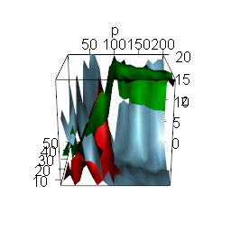
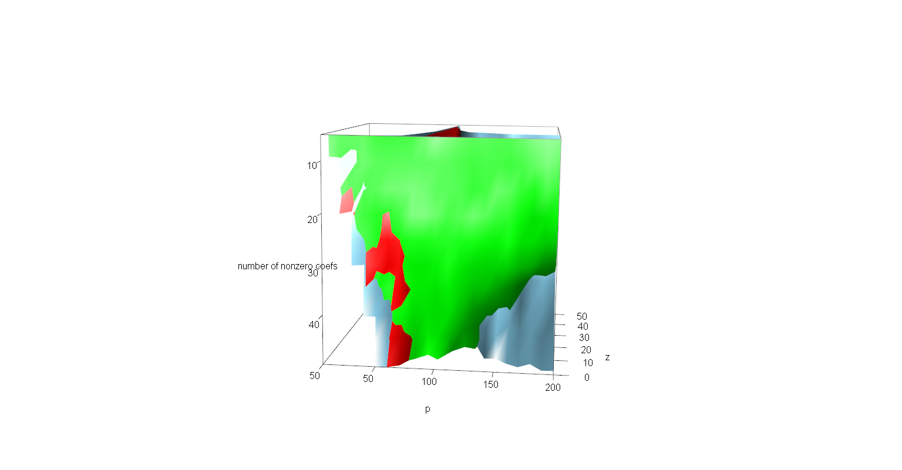

```{r setup, include=FALSE}
knitr::opts_chunk$set(echo = TRUE, cache=TRUE, eval = TRUE, strip.white=TRUE)
```

# Preliminaries {.unnumbered}

Groups of students are asked to send an `R markdown` report generated via
`R studio` to
[franck.picard\@ens-lyon.fr](mailto:franck.picard@ens-lyon.fr){.email} at the
end of the tutorial. You will need `Rstudio`, \LaTeX and packages for markdown:

```{r, message=FALSE, eval=TRUE}
library(knitr)
library(rmarkdown)
library(graphics) ##Necessary for plots
library(pracma)
library(glmnet)
library(rgl)
```

This report should answer the questions by commentaries and codes generating
appropriate graphical outputs. [A cheat sheet of the markdown syntax can be
found here.](https://github.com/adam-p/markdown-here/wiki/Markdown-Cheatsheet)

# Regression model

This project aims at studying the empirical properties of the LASSO based on
simulated data. The statistical framework is the linear regression model, such
that
$$Y_i = x_i^T \beta^* +\varepsilon_i, \,\, \varepsilon_i \sim \mathcal{N}(0,\sigma^2),$$
with $Y$ a vector in $\mathbb{R}^n$, and $\beta^*$ a vector in $\mathbb{R}^p$
with $p_0$ non-null elements. In the following
$J_0=\{j \in \{1,...,p\}, \beta_j^* \neq 0\}$. For simplification, we will
consider that there is only one distinct non null value in $\beta^*$:
$\beta^* = \beta_0^* \times (1,...,1,0,...0)$.

# Simulation of observations

```{r, message=FALSE,fig.show="true",eval=T}
n       = 100
p       = 10
p0      = 5
sigma   = 1
sigmaX  = 1
b0      = 1
beta0   = c(rep(b0,p0),rep(0,p-p0))
X       = sapply(1:p, FUN=function(x){rnorm(n,0,sigmaX)})
Y       = X%*%beta0 + rnorm(n,0,sigma)

plot(Y,X%*%beta0)

```

# Lasso and the $\texttt{glmnet}$ $\texttt{R}$-package

In practice, model parameters are estimated using the $\texttt{glmnet}$
$\texttt{R}$-package to compute the lasso estimator
$$\widehat{\beta}_{\lambda} = \min_{\beta_0,\beta} \frac{1}{N} \sum_{i=1}^{N} w_i l(y_i,\beta_0+\beta^T x_i) + \lambda\left[(1-\alpha)||\beta||_2^2/2 + \alpha ||\beta||_1\right],$$
with $\alpha=1$ for the Lasso, $\alpha=0$ for Ridge Regression and
$\alpha \in ]0,1[$ for Elastic Net. In a first step you are invited to check the
online documentation of the package that is very complete. Then the purpose of
calibration is to determine the value of the hyperparameter $\lambda$ based on
the observations.

```{r, message=FALSE,fig.show="true",eval=T}
library(glmnet)
n       = 100
p       = 10
p0      = 5
sigma   = 1
sigmaX  = 1
b0      = 1
beta0   = c(rep(b0,p0),rep(0,p-p0))
X       = sapply(1:p, FUN=function(x){rnorm(n,0,sigmaX)})
Y       = X%*%beta0 + rnorm(n,0,sigma)

fit = glmnet(X, Y)
plot(fit,label=TRUE)
names(fit)
print(fit)
coef(fit)
```

# Numerical Calibration in practice

Parameter $\lambda$ is chosen by cross validation using \texttt{cv.glmnet} such
that:

```{r, message=TRUE,eval=T}
library(glmnet)
n       = 100
p       = 10
p0      = 5
sigma   = 1
sigmaX  = 1
b0      = 1
beta0   = c(rep(b0,p0),rep(0,p-p0))
X       = sapply(1:p, FUN=function(x){rnorm(n,0,sigmaX)})
Y       = X%*%beta0 + rnorm(n,0,sigma)

lambda.cv = cv.glmnet(X,Y, family = "gaussian",intercept=F)$lambda.1se  ##Careful, .1se seems to be highest lambda within one standard error of .min (in the simulation we will use .min)
bh        = glmnet(X,Y,family = "gaussian",intercept=F, 
                   lambda=lambda.cv)$beta
if ( sum(abs(bh))==0 ) {bh = rep(0,p)}
bh        = as.vector(bh)

```

The first part of your projet will be to re-implement the cross validation
procedure, and to verify that your implementation is correct based on the
\texttt{cv.glmnet} function that will be used to check your results. You will
also implement the calibration of $\lambda$ based on the AIC and on the BIC.

# Simulations setting

The performance of the lasso depends on different factors, and numerical
simulations are used to study the impact of these factors on the capacity of the
lasso to select the dimension of the model. Among those factors, we can identify
$n$ (number of observations), $p$ (dimensionality), $p_0$ and $\beta^*$
(strength of the signal), $\sigma$ (strength of noise). Studying the impact of
all factors would not be realistic, so we focus on:

-   $n/p$ will be chosen so that we study the "low-dimensional regime" as well
    as the "high-dimensional regime".
-   $p_0$ will be fixed at 5
-   $\beta_0^*=1$
-   $\sigma$ will vary.

As an indicator of performance, we will study only the dimension of the selected
model, ie $\hat{s} = \sum_{j=1}^p 1_{\hat{\beta}_j \neq 0}$. In order to conduct
your simulations, you will start from the following example code:

```{r, message=TRUE,fig.show="true",eval=T}
n      = 100
p      = 10
p0     = 5  #Number of nonzero coefficients
sigma  = 1
sigmaX = 1
b0     = 1
beta0  = c(rep(b0,p0),rep(0,p-p0))       
B      = 10 #Number of simulations
res    = matrix(NA,ncol=5,nrow=B) #Stores n,p, sigma, number of nonzero 
                  #coefficients recovered, number of nz incorrectly identified

betah  = matrix(NA, ncol = p, nrow = B)

# fixed design setting
X = sapply(1:p, FUN=function(x){rnorm(n,0,sigmaX)})

for (b in 1:B){
  Y     = X%*%beta0 + rnorm(n,0,sigma)
  # estimate betah using the calibrated lasso
  # betah = 
  lambda.cv = cv.glmnet(X,Y, family = "gaussian",intercept=F)$lambda.1se
  temp = glmnet(X,Y,family = "gaussian",intercept=F, lambda=lambda.cv)$beta  
  ##the value returned by glmnet(...)$beta is a sparse matrix
  #In a sparse matrix : @i (non zero indices); @x non zero values

  indices_identified = c(rep(0, p)) #Fill indices_identified with 1 at 
                                    #indices in temp@i, set others to 0
  for (index in temp@i) {
    indices_identified[index] = 1
  }
  
  betah[b,]  = c(temp@i, rep(NA, p-length(temp@i))) #We store in betah[b,]
    #the nonzero indices and we fill with NA to get a vector of the proper size
  res[b,] = c(n, p, sigma, length(temp@i), sum(abs(indices_identified - beta0)))
}
res           = as.data.frame(res)
colnames(res) = c("n","p","sigma","nz", "nzcorrect")


hist1<-hist(res$nz, breaks = 1:10, axes = FALSE, 
            xlab="Number of non-zero coefs in beta", 
            main = "Number of coefficients identified")
axis(side=1,at=hist1$mids,labels=1:9) #So that breakpoints are centered
axis(side=2)          #Because of previous trick, we had to hide both axis, 
                      #so we display again the Y-axis


hist2 <- hist(res$nzcorrect, breaks = 0:10, axes = FALSE, 
              xlab="Number of incorrect coefs in beta", 
              main = "Number of coefficients incorrectly identified")
axis(side=1,at=hist2$mids,labels=0:9)
axis(side=2)


```

## AIC

In this section, we implement the Akaike Information Criterion (AIC):
$$AIC = 2k - 2ln(\hat{L})$$ where $\hat{L}$ is the maximum value of the
likelihood function for the model under consideration. The procedure consists of
computing the Lasso with parameters $\lambda_1,\cdots,\lambda_N$.

```{r}

n      = 100
p      = 10
p0     = 5  #Number of nonzero coefficients
sigma  = 1
sigmaX = 1
b0     = 1
beta0  = c(rep(b0,p0),rep(0,p-p0))       
betah  = matrix(NA, ncol = p, nrow = B)
X = sapply(1:p, FUN=function(x){rnorm(n,0,sigmaX)})
Y     = X%*%beta0 + rnorm(n,0,sigma)


N <- 500 #Number of lambda tested
lambda_step <- 0.005 #Difference between two consecutive lambda
lambda_init <- 0.005 #First value used by lambda

lambda <- lambda_init
results_frame <- data.frame(
  lambda = c(),
  betah = c(),
  k = c(),
  loglikelihood = c(),
  AIC = c(),
  Cp = c(),
  AICc = c(),
  BIC = c()
)

for (b in 1:N){#The increment is lambda
  temp = glmnet(X,Y,family = "gaussian",intercept=F, lambda=lambda)$beta  
  ##the value returned by glmnet(...)$beta is a sparse matrix
  #In a sparse matrix : @i (non zero indices); @x non zero values

  betah <- c(rep(0,p))
  j<-0
  for(i in temp@i){
    betah[i+1] <- temp@x[j+1]
    j<-j+1
  }

  #llik = log(((1/sqrt(2 * pi))**(p/2))*exp(-t(Y-betah)%*%(Y-betah)/(2)))
  RSS = t(Y-X%*%betah)%*%(Y-X%*%betah) #Simpler expression for log likelihood in Gaussian case (probably not correct)
  new_row_df <- data.frame(
    lambda = lambda,
    betah = betah,
    k = j,
    negloglikelihood = -log(RSS), 
    AIC = 2*j + n*log(RSS/n),
    Cp = RSS + 2*j*sigma/n,
    AICc = 2*j + n*log(RSS/n) + 2*j*(j+1)/(n-j-1),
    BIC = j*log(n) + n*log(RSS/n)
  )
  results_frame <- rbind(results_frame, new_row_df)
  
  lambda <- lambda+lambda_step

}
results_frame$AIC <- results_frame$AIC - min(results_frame$AIC)
results_frame$Cp <- results_frame$Cp - min(results_frame$Cp)
results_frame$AICc <- results_frame$AICc - min(results_frame$AICc)
results_frame$BIC <- results_frame$BIC - min(results_frame$BIC)

lambda_cv = cv.glmnet(X,Y, family = "gaussian",intercept=F)$lambda.min  #We compute the cross validation solution
s <- c(rep(lambda_cv, 1000))  #And fill an axis with it
axis_lambda_cv <- xy.coords(x=s, y = 1:1000)  #that we will give to the plot

plot(x = results_frame$lambda, y = results_frame$AIC, type = "n", xlab = "lambda", ylab = "AIC(theta_lambda)", ylim=c(0, 200)) #type = "n" makes it so that we can add the axis after initialization
plot.xy(axis_lambda_cv, type = "l") #type = "l" to draw lines
plot.window(c(0.95*lambda_init, 1.05*lambda ), ylim = c(0.95*min(results_frame$AIC), 1.15*max(results_frame$AIC)))
plot.xy( list(results_frame$lambda, results_frame$AIC, NULL, NULL), type="p")

plot(x = results_frame$lambda, y = results_frame$Cp, type = "n", xlab = "lambda", ylab = "C_p(theta_lambda)", ylim=c(0, 200)) #type = "n" makes it so that we can add the axis after initialization
plot.xy(axis_lambda_cv, type = "l") #type = "l" to draw lines
plot.window(c(0.95*lambda_init, 1.05*lambda ), ylim = c(0.95*min(results_frame$AIC), 1.15*max(results_frame$AIC)))
plot.xy( list(results_frame$lambda, results_frame$AIC, NULL, NULL), type="p")

plot(x = results_frame$lambda, y = results_frame$AICc, type = "n", xlab = "lambda", ylab = "AICc(theta_lambda)", ylim = c(0,200)) #type = "n" makes it so that we can add the axis after initialization
plot.xy(axis_lambda_cv, type = "l") #type = "l" to draw lines
plot.window(c(0.95*lambda_init, 1.05*lambda ), ylim = c(0.95*min(results_frame$AICc), 1.15*max(results_frame$AICc)))
plot.xy( list(results_frame$lambda, results_frame$AICc, NULL, NULL), type="p")


plot(x = results_frame$lambda, y = results_frame$BIC, type = "n", xlab = "lambda", ylab = "BIC(theta_lambda)", ylim = c(0,200)) #type = "n" makes it so that we can add the axis after initialization
plot.xy(axis_lambda_cv, type = "l") #type = "l" to draw lines
plot.window(c(0.95*lambda_init, 1.05*lambda ), ylim = c(0.95*min(results_frame$BIC), 1.15*max(results_frame$BIC)))
plot.xy( list(results_frame$lambda, results_frame$BIC, NULL, NULL), type="p")


```

We then define the best value for $\lambda$ with respect to AIC
as:$$\lambda_{AIC} = argmin_{\lambda_i} AIC.$$

Hence, for each $i$ we need to compute the likelihood of the model with
parameter $\beta_{\lambda_i}$ and $k$ as the number of nonzero coefficients of
$\beta_{\lambda_i}$. The likelihood, with Gaussianity assumption and covariance
matrix $\sigma I$, is given by
$$\hat{L_{\lambda_i}} = \Pi_{i=1}^n \frac{1}{\sqrt{2\pi}\sigma}\exp(-\frac{1}{2\sigma^2}(Y_i-\beta)^t(Y_i-\beta)$$.
In our setting, we compute $S = \sum_i (Y_i - \beta_\lambda)^2$ and then
$$L_Y(\lambda) = (2\pi\sigma^2)^{-\frac{n}{2}}\exp(-\frac{1}{2\sigma^2}S)$$ For
each instance of $Y = X\theta^* + \epsilon$ for given parameters
$p/n$(dimensionality)\$ of $k = s*(p/n)$ (sparsity), while the others are fixed;
we obtain lambda_AIC, lambda_CV, lambda_BIC,..... the optimal calibration of
lasso for a same problem and a given criterion.

We want to know given the dimensionality and perhaps the sparsity which
criterion is optimal. For each instance of $Y=X\theta^*$ we may define
$$\lambda_{opt} = Argmin_{\lambda} || X\theta^* - X\hat{\theta}_{\lambda}||_2$$
the "optimal" value of lambda, in the sense that given the solution $\theta^*$
(unknown in practice), we look for the lambda that would give the model with the
smallest error (where the argmin could run through all lambdas or only on the
one given by our criterions). Note that the choice of definition of
$\lambda_{opt}$ is arbitrary, replacing the norm by an
$\ell^1, \ell^\infty,\cdots$ can be justified and the argmin could ignore the
dependence on $X$.

Idea : modelling $\lambda_{opt}$ as a function of the dimensionality, the
sparsity, the different criterions Naive idea: Define the norm in the argmin as
some sup norm so that $\\hat{lambda}_{opt}$ is the criterion that gives the
lambda of the criterion which is closest from sparsity estimate. Improved: A
nearest-neighbour Improved (bis): Model $\hat{\lambda}_{opt}$ as some linear
combination of $p/n, s, \lambda_{AIC}, \lambda_{BIC}, \dots$. Improved (ter):
Model as a polynomial/log linear of $p/n$ and $s$ (and
$\lambda_{AIC}, \lambda_{Bic},\cdots$)

```{r, results='hide'}
##We fix p, n and k
#We run M instances of Y = X\theta + eps
#Each time we obtain $\lambda_{AIC, CV, opt}$ and we create a list which contains for each possible index (AIC or CV) the number of times it is the closest from lambda_opt
#We plot the histogram to get an idea if AIC or CV is best in our setup
#TODO : same thing, but instead pick an index whenever it is the one that gives the $\hat{\beta_\lambda}$ which is closest from $\beta^*$
n      = 100
p      = 10
p0     = 5  #Number of nonzero coefficients
sigma  = 1
sigmaX = 1
b0     = 1
beta0  = c(rep(b0,p0),rep(0,p-p0))       
betah  = matrix(NA, ncol = p, nrow = B)


B <- 20 #Number of lambda tested
lambda_step <- 0.1 #Difference between two consecutive lambda
lambda_init <- 0.0 #First value used by lambda
  
  
results_short <- data.frame(
  lambda_AIC =c(),
  lambda_AICc = c(),
  lambda_CV = c(),
  lambda_opt = c(),
  best_criterion = c()
)

N<- 10 ## Number of instances of solving Y=X\theta + ups
for(t in 1:N){
  
  X = sapply(1:p, FUN=function(x){rnorm(n,0,sigmaX)})
  Y = X%*%beta0 + rnorm(n,0,sigma)

  lambda <- lambda_init
  results_frame <- data.frame(
    lambda = c(),
    betah = c(),
    k = c(),
    loglikelihood = c(),
    AIC = c(),
    BIC = c()
  )
  
  err_opt <- NA
  lambda_opt <- 1
  
  for (b in 1:B){#The increment is lambda
    temp = glmnet(X,Y,family = "gaussian",intercept=F, lambda=lambda)$beta  
    ##the value returned by glmnet(...)$beta is a sparse matrix
    #In a sparse matrix : @i (non zero indices); @x non zero values
  
    betah <- c(rep(0,p))
    j<-0
    for(i in temp@i){
      betah[i+1] <- temp@x[j+1]
      j<-j+1
    }
  
    #llik = log(((1/sqrt(2 * pi))**(p/2))*exp(-t(Y-betah)%*%(Y-betah)/(2)))
    RSS = t(Y-X%*%betah)%*%(Y-X%*%betah) #Simpler expression for log likelihood in Gaussian case (probably not correct)
    new_row_df <- data.frame(
      lambda = lambda,
      betah = betah,
      k = j,
      negloglikelihood = -log(RSS), 
      AIC = 2*j + n*log(RSS/n),
      AICc = 2*j + n*log(RSS/n) + 2*j*(j+1)/(n-j-1),
      BIC = j*log(n) + n*log(RSS/n)
    )
    results_frame <- rbind(results_frame, new_row_df)
    if(err_opt >= Norm(betah - beta0, p=2) || is.na(err_opt)){
      lambda_opt <- lambda   #Obtaining the lambda which gives the solution closest from the true value
      err_opt <- Norm(betah - beta0, p = 2)
    }
    lambda <- lambda+lambda_step
  }
  esc <-1
  lambda_min_AIC <- results_frame$AIC[0]
  min_lambda_AIC <- min(results_frame$AIC)
  i<-1
  while (esc != 0 || i < B) {
    if( min_lambda_AIC >= results_frame$AIC[i]){
      esc = 0
      lambda_min_AIC <-results_frame$lambda[i]  #Obtaining the optimal value of lambda for AIC (a faster technique to do that probably exists)
    }
    i<- i + 1
  }
  esc <-1
  lambda_min_AICc <- results_frame$AICc[0]
  min_lambda_AICc <- min(results_frame$AICc)
  i<-1
  while (esc != 0 || i < B) {
    if( min_lambda_AICc >= results_frame$AICc[i]){
      esc = 0
      lambda_min_AICc <-results_frame$lambda[i]  #Obtaining the optimal value of lambda for AIC (a faster technique to do that probably exists)
    }
    i<- i + 1
  }
  
  new_row_short_df <- data.frame(
    lambda_AIC = lambda_min_AIC,
    lambda_AICc = lambda_min_AICc,
    lambda_CV = cv.glmnet(X,Y, family = "gaussian",intercept=F)$lambda.min,
    lambda_opt = lambda_opt,
    best_criterion = NA
  )
  if(abs(new_row_short_df$lambda_AIC - new_row_short_df$lambda_opt) > abs(new_row_short_df$lambda_CV - new_row_short_df$lambda_opt)){
    new_row_short_df$best_criterion = 0 ##0 : best criterion is CV
  }
  else{
    new_row_short_df$best_criterion = 1  ##1: best criterion is AIC
  }
  results_short <- rbind(results_short, new_row_short_df)
  disp(t, "/", N)
}

```


```{r}
hist(results_short$best_criterion, main = "Hist of best criterion between CV (0) and AIC (1)")


```

```{r}
###We wrap the previous code in a function
#Then we compute for varying $n/p$ whether best is AIC, BIC or CV

GetLambdaComparison <- function(n = 100,
                                p      = 10,
                                p0     = 5,  #Number of nonzero coefficients
                                sigma  = 1,
                                sigmaX = 1,
                                b0     = 1,
                                B = 20, #Number of lambda tested
                                N = 10, #Number of instances of solving Y = X\theta + eps
                                lambda_step = 0.1, #Difference between two consecutive lambda
                                lambda_init = 0.0 #First value used by lambda
                                ){
  
  if(p < p0 ){##We treat this (impossible) case so that we can obtain dataframes of equal size (for plotting)
    results_short <- data.frame(
      lambda_AIC =NA,
      lambda_AICc = NA,
      lambda_BIC = NA,
      lambda_CV = NA,
      lambda_opt = NA,
      best_criterion = NA,
      res_AIC = NA,
      res_AICc = NA,
      res_BIC = NA,
      res_CV = NA
    )
    # results_short_row <- data.frame(
    #   lambda_AIC =NA,
    #   lambda_BIC = NA,
    #   lambda_CV = NA,
    #   lambda_opt = NA,
    #   best_criterion = NA
    # )
    # results_short <- rbind(results_short, results_short_row)
    
    return(results_short)
  }
  
  beta0  = c(rep(b0,p0),rep(0,p-p0))
  betah  = matrix(NA, ncol = p, nrow = B)
    
  results_short <- data.frame(
    lambda_AIC =c(),
    lambda_AICc = c(),
    lambda_BIC = c(),
    lambda_CV = c(),
    lambda_opt = c(),
    best_criterion = c(),
    res_AIC = c(),
    res_AICc = c(),
    res_BIC = c(),
    res_CV = c()
  )
  
  if(n<30){
    print("Warning, if n < 30, cv will start throwing warnings")
  }
  
  for(t in 1:N){ ##We do the simulation N times
    
    X = sapply(1:p, FUN=function(x){rnorm(n,0,sigmaX)})
    Y = X%*%beta0 + rnorm(n,0,sigma)
  
    lambda <- lambda_init
    results_frame <- data.frame(
      lambda = c(),
      betah = c(),
      k = c(),
      loglikelihood = c(),
      AIC = c(),
      AICc = c(),
      BIC = c()
    )
    
    err_opt <- NA
    lambda_opt <- 1
    min_lambda_AIC <- NA
    lambda_AIC <- NA
    min_lambda_AICc <- NA
    lambda_AICc <- NA
    min_lambda_BIC <- NA
    lambda_BIC <- NA
    for (b in 1:B){#The increment is lambda
      temp = glmnet(X,Y,family = "gaussian",intercept=F, lambda=lambda)$beta  
      ##the value returned by glmnet(...)$beta is a sparse matrix
      #In a sparse matrix : @i (non zero indices); @x non zero values
    
      betah <- c(rep(0,p))
      j<-1
      for(i in temp@i){
        betah[i+1] <- temp@x[j]
        j<-j+1
      }
    
      #llik = log(((1/sqrt(2 * pi))**(p/2))*exp(-t(Y-betah)%*%(Y-betah)/(2)))
      RSS = t(Y-X%*%betah)%*%(Y-X%*%betah) #Simpler expression for log likelihood in Gaussian case (probably not correct)
      new_row_df <- data.frame(
        lambda = lambda,
        betah = betah,
        k = j,
        negloglikelihood = -log(RSS), 
        AIC = 2*j + n*log(RSS),
        AICc = 2*j + n*log(RSS/n) + 2*j*(j+1)/(n-j-1),
        BIC = j*log(n) + n*log(RSS/n)
      )
      results_frame <- rbind(results_frame, new_row_df)
      
      ##Before restarting to loop we check for the best value for lambda_opt
      if(err_opt >= Norm(betah - beta0, p=2) || is.na(err_opt)){
        lambda_opt <- lambda   #Obtaining the lambda which gives the solution closest from the true value
        err_opt <- Norm(betah - beta0, p = 2)
      }
      
      #And we also search for the best value for lambda under AIC
      if(min_lambda_AIC > new_row_df$AIC || is.na(min_lambda_AIC)){
        min_lambda_AIC <- new_row_df$AIC
        lambda_AIC <- lambda
      }
      #And we also search for the best value for lambda under AICc
      if(min_lambda_AICc > new_row_df$AICc || is.na(min_lambda_AICc)){
        min_lambda_AICc <- new_row_df$AICc
        lambda_AICc <- lambda
      }
      #And we also search for the best value for lambda under BIC
      if(min_lambda_BIC > new_row_df$BIC || is.na(min_lambda_BIC)){
        min_lambda_BIC <- new_row_df$BIC
        lambda_BIC <- lambda
      }
      lambda <- lambda+lambda_step
    }##End of for loop for finding best lambda (depending on criterion)
    

    ##We create a frame in which we store the best values obtained
    new_row_short_df <- data.frame(
      lambda_AIC = lambda_AIC,
      lambda_AICc = lambda_AICc,
      lambda_BIC = lambda_BIC,
      lambda_CV = cv.glmnet(X,Y, family = "gaussian",intercept=F)$lambda.min,
      lambda_opt = lambda_opt,
      best_criterion = NA,
      res_AIC = norm(glmnet(X,Y, family = "gaussian", lambda = lambda_AIC, intercept = F)$beta - glmnet(X,Y, family = "gaussian", lambda = lambda_opt, intercept = F)$beta),      
      res_AICc = norm(glmnet(X,Y, family = "gaussian", lambda = lambda_AICc, intercept = F)$beta - glmnet(X,Y, family = "gaussian", lambda = lambda_opt, intercept = F)$beta),
      res_BIC = norm(glmnet(X,Y, family = "gaussian", lambda = lambda_BIC, intercept = F)$beta - glmnet(X,Y, family = "gaussian", lambda = lambda_opt, intercept = F)$beta),
      res_CV = NA
    )
    new_row_short_df$res_CV = norm(glmnet(X,Y, family = "gaussian", lambda = new_row_short_df$lambda_CV, intercept = F)$beta - glmnet(X,Y, family = "gaussian", lambda = lambda_opt, intercept = F)$beta)
    
    ##We check which criterion gives the closest lambda wrt lambda_opt
    if(min(abs(new_row_short_df$lambda_AIC - new_row_short_df$lambda_opt), abs(new_row_short_df$lambda_BIC - new_row_short_df$lambda_opt)) > abs(new_row_short_df$lambda_CV - new_row_short_df$lambda_opt)){
      new_row_short_df$best_criterion = 0 ##0 : best criterion is CV
    }
    else if(    abs(new_row_short_df$lambda_AIC - new_row_short_df$lambda_opt) 
                  > abs(new_row_short_df$lambda_BIC - new_row_short_df$lambda_opt) 
            ){
      new_row_short_df$best_criterion = 2  ##1: best criterion is BIC
    }
    else{
        new_row_short_df$best_criterion = 1  ##1: best criterion is AIC
    }
    
    
    results_short <- rbind(results_short, new_row_short_df)
  }##End of for loop for computing on different instance of Y = Xbeta + eps
  
  
  return(results_short)
}
```

```{r, results='hide'}

n <- 100
prange<- (0:40)*5
ratio_best_AIC = c(rep(0,length(prange)))
ratio_best_BIC = c(rep(0,length(prange)))
ratio_best_CV = c(rep(0,length(prange)))

result_var_np = data.frame(
  p = c(),
  num_AIC_best = c(),   ##Number of times when AIC is the best
  num_CV_best = c(),   ##Number of times when CV is best
  num_BIC_best = c(),
  err_AIC = c(),
  err_BIC = c(),
  err_CV = c()
)
for(s in 1:length(prange)){
  results_lambda <- GetLambdaComparison(n=n, p = prange[s], B = 20, N= 50)
  new_row_result_var_np = data.frame(
    p = prange[s],
    num_AIC_best = sum(results_lambda$best_criterion == 1),
    num_CV_best = sum(results_lambda$best_criterion == 0),
    num_BIC_best = sum(results_lambda$best_criterion == 2),
    err_AIC = mean(results_lambda$res_AIC, na.rm = TRUE),
    err_AICc = mean(results_lambda$res_AICc, na.rm = TRUE),
    err_BIC = mean(results_lambda$res_BIC, na.rm = TRUE),
    err_CV = mean(results_lambda$res_CV, na.rm = TRUE)
  )

    ratio_best_AIC[s] <- new_row_result_var_np$num_AIC_best / (new_row_result_var_np$num_CV_best + new_row_result_var_np$num_AIC_best + new_row_result_var_np$num_BIC_best)
  ratio_best_BIC[s] <- new_row_result_var_np$num_BIC_best / (new_row_result_var_np$num_CV_best + new_row_result_var_np$num_AIC_best + new_row_result_var_np$num_BIC_best)
  ratio_best_CV[s] <- new_row_result_var_np$num_CV_best / (new_row_result_var_np$num_CV_best + new_row_result_var_np$num_AIC_best + new_row_result_var_np$num_BIC_best)
 
  disp(s, "/", length(prange))
  
  result_var_np <- rbind(result_var_np, new_row_result_var_np)
}


```

```{r}
plot(ratio_best_AIC, x=prange, main = "performance of AIC compared to others", ylab = "Avg number of times when AIC is best", xlab = "p")
plot(ratio_best_BIC, x = prange, main = "performance of BIC compared to others", ylab = "Avg number of times when BIC is best", xlab = "p")
plot(ratio_best_CV, x = prange, main = "performance of CV compared to others", ylab = "Avg number of times when CV is best", xlab = "p")

plot(ratio_best_AIC, x=prange, main = "performance of AIC/BIC/CV", ylab = "Avg number of times each criterion is best", xlab = "p", ylim = c(0,1), type = "b", col="skyblue")
points(ratio_best_BIC, x = prange, type = "b", col = "red")
points(ratio_best_CV, x = prange, type = "b", col = "green")
legend(x="topright", legend=c("AIC", "BIC", "CV"), fill=c("skyblue", "red", "green"))


plot(result_var_np$err_AIC, x = prange, main = "Avg l2 error", ylab = "Avg error", xlab = "p", type = "b", col = "skyblue")
points(result_var_np$err_BIC, x = prange, type = "b", col ="red")
points(result_var_np$err_CV, x = prange, type = "b", col = "green")
points(y=result_var_np$err_AICc, x = prange, type = "b", col="yellow")

legend(x="topright", legend=c("AIC", "BIC", "CV", "AICc"), fill=c("skyblue", "red", "green", "yellow"))

```


We now compute, depending on n/p and k (the number of nonzero coefficient) the
performance of AIC, BIC and CV.

```{r}
##We wrap the previous code in a function to get, for fixed n and a fixed sparsity level k/n, the results when we vary p
#Then we will vary k between some values and then display the results
CompareCriterionVarNP <- function(
                                n = 100,
                                prange      = 5:200, #List of p tested, all p should be larger than p0
                                p0     = 5,  #Number of nonzero coefficients
                                sigma  = 1,
                                sigmaX = 1,
                                b0     = 1,
                                B = 30, #Number of lambda tested
                                N = 10, #Number of instances of solving Y = X\theta + eps
                                lambda_step = 0.05, #Difference between two consecutive lambda
                                lambda_init = 0.0 #First value used by lambda
  
                                  ){
  # result_var_np = data.frame(
  #   p = c(rep(NA, max(p0 - prange[1], 0))),
  #   num_AIC_best = c(rep(NA, max(p0 -prange[1], 0))),   ##Number of times when AIC is the best
  #   num_CV_best = c(rep(NA, max(p0 -prange[1], 0))),   ##Number of times when CV is best
  #   num_BIC_best = c(rep(NA, max(p0 -prange[1], 0)))
  #   
  #   ## prange[1]  prange[2]   
  #   #k1  k2  k3
  #   # k < prange[1] -> _best[k, ..., prange[1]] = NA
  # )
  result_var_np = data.frame(
    p = c(),
    num_AIC_best = c(),
    num_CV_best = c(),
    num_BIC_best = c(),
    err_AIC = c(),
    err_AICc = c(),
    err_BIC = c(),
    err_CV = c()
  )
  for(p in prange ){
    results_lambda <- GetLambdaComparison(n=n, p = p, B = B, N= N, p0 = p0,sigma = sigma, sigmaX = sigmaX, b0 = b0, lambda_step = lambda_step, lambda_init = lambda_init)
    new_row_result_var_np = data.frame(
      p = p,
      num_AIC_best = sum(results_lambda$best_criterion == 1),
      num_CV_best = sum(results_lambda$best_criterion == 0),
      num_BIC_best = sum(results_lambda$best_criterion == 2),
      err_AIC = mean(results_lambda$res_AIC),
      err_AICc = mean(results_lambda$res_AICc),
      err_BIC = mean(results_lambda$res_BIC),
      err_CV = mean(results_lambda$res_CV)
    )
    result_var_np <- rbind(result_var_np, new_row_result_var_np)

  }
  return(result_var_np)
}
```

```{r, results='hide', eval=FALSE}
n<-100
results_glob = data.frame(
  k = c(),
  comp_criterion = c() 
)
krange = c(5, 10, 20, 30, 40, 50)
prange = c(5, 10, 20, 30, 40, 50, 60, 70, 80, 90, 100, 110, 120, 130, 140, 150, 160, 170, 180, 190, 200)
N = 20
for(k in krange){
  
  new_row = data.frame(
    k = k,
    comp_criterion = CompareCriterionVarNP(n = n, prange = prange, p0 = k,N=N) 
  )

  results_glob <- rbind(results_glob, new_row)
  disp(k, "/", max(krange))
}

```

```{r, eval=FALSE}
##Here we do the plotting 
print(length(results_glob$comp_criterion.num_AIC_best))
x = prange
y = krange
print(length(x)*length(y))
z = matrix(data = results_glob$comp_criterion.num_AIC_best, nrow = length(x), ncol = length(y))
persp3d(x=x, y=y,z=z, ylab = "number of nonzero coefs", xlab = "p", col="skyblue", type = "n")
z = matrix(data = results_glob$comp_criterion.num_BIC_best, nrow = length(x), ncol = length(y))
persp3d(x=x, y=y,z=z, ylab = "number of nonzero coefs", xlab = "p", col="red", type = "n", add = TRUE)
z = matrix(data = results_glob$comp_criterion.num_CV_best, nrow = length(x), ncol = length(y))
persp3d(x=x, y=y,z=z, ylab = "number of nonzero coefs", xlab = "p",  col="green", add = TRUE)
rgl.snapshot("comp_all_crits.png")
```

```{r, eval=FALSE}

z = matrix(data = results_glob$comp_criterion.err_AIC, nrow = length(x), ncol = length(y))
persp3d(x=x, y=y,z=z, ylab = "number of nonzero coefs", xlab = "p", col="skyblue", type = "n")
z = matrix(data = results_glob$comp_criterion.err_AICc, nrow = length(x), ncol = length(y))
persp3d(x=x, y=y,z=z, ylab = "number of nonzero coefs", xlab = "p", col="yellow", type = "n", add = TRUE)
z = matrix(data = results_glob$comp_criterion.err_BIC, nrow = length(x), ncol = length(y))
persp3d(x=x, y=y,z=z, ylab = "number of nonzero coefs", xlab = "p",  col="red", add = TRUE)
z = matrix(data = results_glob$comp_criterion.err_CV, nrow = length(x), ncol = length(y))
persp3d(x=x, y=y,z=z, ylab = "number of nonzero coefs", xlab = "p",  col="green", add = TRUE)
rgl.snapshot("comp_all_crits_error.png")

```






Now, instead of comparing among criterions which one gives the closest lambda to
the best (knowing the true solution) lambda, we want to compare for each
criterion which ones give the right model dimension.

```{r}
GetDimComparison <- function(n = 100,
                                p      = 10,
                                p0     = 5,  #Number of nonzero coefficients
                                sigma  = 1,
                                sigmaX = 1,
                                b0     = 1,
                                B = 100, #Number of lambda tested
                                N = 10, #Number of instances of solving Y = X\theta + eps
                                lambda_step = 0.1, #Difference between two consecutive lambda
                                lambda_init = 0.0 #First value used by lambda
                                ){
  
  if(p < p0 ){##We treat this (impossible) case so that we can obtain dataframes of equal size (for plotting)
    results_short <- data.frame(
      AIC_dim =NA,
      BIC_dim = NA,
      CV_dim = NA,
      true_dim = NA
    )
    return(results_short)
  }
  
  beta0  = c(rep(b0,p0),rep(0,p-p0))
  betah  = matrix(NA, ncol = p, nrow = B)
    
  results_dim <- data.frame(
    AIC_dim =c(),
    BIC_dim = c(),
    CV_dim = c(),
    true_dim = c()
  )
  

  
  for(t in 1:N){
    
    X = sapply(1:p, FUN=function(x){rnorm(n,0,sigmaX)})
    Y = X%*%beta0 + rnorm(n,0,sigma)
  
    lambda <- lambda_init
    results_frame <- data.frame(
      lambda = c(),
      betah = c(),
      k = c(),
      loglikelihood = c(),
      AIC = c(),
      BIC = c()
    )

    min_lambda_AIC <- NA
    lambda_AIC <- NA
    min_lambda_BIC <- NA
    lambda_BIC <- NA
    for (b in 1:B){#The increment is lambda
      temp = glmnet(X,Y,family = "gaussian",intercept=F, lambda=lambda)$beta  
      ##the value returned by glmnet(...)$beta is a sparse matrix
      #In a sparse matrix : @i (non zero indices); @x non zero values
    
      betah <- c(rep(0,p))
      j<-1
      for(i in temp@i){
        betah[i+1] <- temp@x[j]
        j<-j+1
      }
    
      #llik = log(((1/sqrt(2 * pi))**(p/2))*exp(-t(Y-betah)%*%(Y-betah)/(2)))
      RSS = t(Y-X%*%betah)%*%(Y-X%*%betah) #Simpler expression for log likelihood in Gaussian case (probably not correct)
      new_row_df <- data.frame(
        lambda = lambda,
        betah = betah,
        k = j,
        negloglikelihood = -log(RSS), 
        AIC = 2*j + n*log(RSS),
        BIC = j*log(n) + n*log(RSS/n)
      )
      results_frame <- rbind(results_frame, new_row_df)
      
      
      #We search for the best value for lambda under AIC
      if(min_lambda_AIC > new_row_df$AIC || is.na(min_lambda_AIC)){
        min_lambda_AIC <- new_row_df$AIC
        lambda_AIC <- lambda
      }
      #And we also search for the best value for lambda under BIC
      if(min_lambda_BIC > new_row_df$BIC || is.na(min_lambda_BIC)){
        min_lambda_BIC <- new_row_df$BIC
        lambda_BIC <- lambda
      }
      lambda <- lambda+lambda_step
    }
    lambda_CV = cv.glmnet(X,Y, family = "gaussian",intercept=F)$lambda.min
    
    #We compute for each optimal lambda the corresponding solution beta
    Beta_AIC = glmnet(X, Y, family = "gaussian", intercept=F, lambda = lambda_AIC)$beta
    Beta_BIC = glmnet(X, Y, family = "gaussian", intercept=F, lambda = lambda_BIC)$beta
    Beta_CV = glmnet(X, Y, family = "gaussian", intercept=F, lambda = lambda_CV)$beta
   
    #For each beta we compute its dimension
    new_row_results_dim <- data.frame(
      AIC_dim = length(Beta_AIC@i),
      BIC_dim = length(Beta_BIC@i),
      CV_dim = length(Beta_CV@i),
      true_dim = p0
    )
    results_dim <- rbind(results_dim, new_row_results_dim)
  }
  return(results_dim)
}

```

```{r}

dim_compare = GetDimComparison(N = 50, n = 100, p = 100, p0 = 5)

```

```{r}
hist(dim_compare$AIC_dim, breaks = 0:100 +0.5, freq = FALSE)
hist(dim_compare$BIC_dim, breaks =0:100+0.5, freq = FALSE)
hist(dim_compare$CV_dim, breaks =0:100 +0.5, freq = FALSE)

```

We obtain from previous plots (with e.g. N=100, p=10 or p =100) that CV is the
best criterion to obtain the right model dimension. Also BIC performs better
than AIC for dimension identification, however in a high dimensional setting,
the performance of BIC is quite low. In order to back this claim, we do as
before and display for varying $n/p$ the dimension of the models identified by
the different criterions.

We now plot, depending on n/p and k (the number of nonzero coefficient) the
performance (avg model dimension) of AIC, BIC and CV.

```{r, results='hide'}
##We wrap the previous code in a function to get, for fixed n and a fixed sparsity level k/n, the results when we vary p
#Then we will vary k between some values and then display the results
CompareDimCriterionVarNP <- function(
                                n = 100,
                                prange      = 5:200, #List of p tested, all p should be larger than p0
                                p0     = 5,  #Number of nonzero coefficients
                                sigma  = 1,
                                sigmaX = 1,
                                b0     = 1,
                                B = 30, #Number of lambda tested
                                N = 10, #Number of instances of solving Y = X\theta + eps
                                lambda_step = 0.05, #Difference between two consecutive lambda
                                lambda_init = 0.0 #First value used by lambda
                                  ){
  # result_dim_var_np = data.frame(
  #   p = c(rep(prange[1], max(prange[1]-1, 0))),
  #   dim_AIC = c(rep(NA, prange[1]-1)),   ##Average dimension of AIC
  #   dim_BIC = c(rep(NA, prange[1]-1)),   ##of BIC
  #   dim_CV = c(rep(NA, prange[1]-1)),    ##of CV
  #   dim_true = c(rep(NA, prange[1] - 1))
  # )
  result_dim_var_np = data.frame(
    p = c(),
    dim_AIC = c(),
    dim_BIC = c(),
    dim_CV = c(),
    dim_true = c()
  )
  for(s in 1:length(prange)){
    results_dim <- GetDimComparison(n=n, p = prange[s], B = B, N= N, p0 = p0, sigma = sigma, sigmaX = sigmaX, b0 = b0, lambda_step = lambda_step, lambda_init = lambda_init)
    new_row_result_dim_var_np = data.frame(
      p = prange[s],
      dim_AIC = mean(results_dim$AIC_dim, na.rm=TRUE),
      dim_BIC = mean(results_dim$BIC_dim, na.rm=TRUE),
      dim_CV = mean(results_dim$CV_dim, na.rm=TRUE),
      dim_true = p0
    )
    result_dim_var_np <- rbind(result_dim_var_np, new_row_result_dim_var_np)
    
    #disp(s, "/", length(prange))
  }
  return(result_dim_var_np)
}
```

We compute estimated dimension with fixed n,p,sigma^2 for varying p_0
```{r, results='hide'}
krange = 1:25
dim_AIC_k = c(rep(0,length(krange)))
dim_BIC_k = c(rep(0,length(krange)))
dim_CV_k = c(rep(0,length(krange)))
dim_true_k = krange

for(i in 1:length(krange)){
  new_row_var_spars <- GetDimComparison(n=100, p = 25, B = 50, N= 30, p0 = krange[i])
  dim_AIC_k[i] = mean(new_row_var_spars$AIC_dim, na.rm=TRUE)
  dim_BIC_k[i] = mean(new_row_var_spars$BIC_dim, na.rm=TRUE)
  dim_CV_k[i] = mean(new_row_var_spars$CV_dim, na.rm=TRUE)
  disp(i, "/", max(krange))
}


```
```{r}
plot(y=dim_AIC_k, x=krange, xlab="p_0", ylab="estimated dimension", ylim = c(0,25), col = "skyblue", type="b")
points(y=dim_BIC_k, x=krange, xlab="p_0", ylab="estimated dimension", col = "red", type="b")
points(y=dim_CV_k, x=krange, xlab="p_0", ylab="estimated dimension", col = "green", type="b")
points(y=dim_true_k, x=krange, xlab="p_0", ylab="estimated dimension", col = "purple", type="b")
legend(x="topright", legend=c("AIC", "BIC", "CV", "true"), fill=c("skyblue", "red", "green", "purple"))

```


```{r, results='hide', eval=FALSE}


results_dim_glob = data.frame(
  k = c(),
  comp_criterion = c() 
)


n = 50
krange = c(1, 2, 3, 4, 5, 10, 15, 20, 25, 30, 35, 40, 45, 50)
prange = c(5, 10, 15, 20, 25, 30, 35, 40, 45, 50, 55, 60, 65, 70, 75, 80, 85, 90, 95, 100)

for(k in krange){
  new_row_dim = data.frame(
    k = k,
    comp_criterion = CompareDimCriterionVarNP(n = n, prange = prange, p0 = k) 
  ) 
  results_dim_glob <- rbind(results_dim_glob, new_row_dim)
  disp(k,"/", max(krange))  
}
```

And we plot the results

```{r, results='hide', eval=FALSE}
##Here we do the plotting 
print(length(results_dim_glob$comp_criterion.dim_CV))
y = krange
x = prange

print(length(x)*length(y))
z = matrix(data = results_dim_glob$comp_criterion.dim_AIC, nrow = length(x), ncol = length(y))
persp3d(x=x, y=y,z=z, ylab = "number of nonzero coefs", xlab = "p", col="skyblue", type = "n")
z = matrix(data = results_dim_glob$comp_criterion.dim_BIC, nrow = length(x), ncol = length(y))
persp3d(x=x, y=y,z=z, ylab = "number of nonzero coefs", xlab = "p", col="red", type = "n", add = TRUE)
z = matrix(data = results_dim_glob$comp_criterion.dim_CV, nrow = length(x), ncol = length(y))
persp3d(x=x, y=y,z=z, ylab = "number of nonzero coefs", xlab = "p",  col="green", add = TRUE)
z = matrix(data = results_dim_glob$comp_criterion.dim_true, nrow = length(x), ncol = length(y))
persp3d(x=x, y=y,z=z, ylab = "number of nonzero coefs", xlab = "p",  col="purple", add = TRUE)
rgl.snapshot("comp_all_crits_dim.png")
```

 We can observe that when $p=p0$, then all
criterions perform equally. This probably comes from (TODO : check and add
details) the fact when the sparsity of the input vector is constant and $p=p0$,
hence AIC and BIC can be proved equivalent. Also, in the Gaussian case this
certainly amounts to solving a least square to find the CV solution which is the
same as for AIC or BIC.

We can also take a closer look at what happens in the sparse low dimensional
area:

```{r, results='hide', eval=FALSE}
results_dim_glob = data.frame(
  k = c(),
  comp_criterion = c() 
)


n = 50
krange = 1:25
prange = 2*(2:25)

for(k in krange){
  new_row_dim = data.frame(
    k = k,
    comp_criterion = CompareDimCriterionVarNP(n = n, prange = prange, p0 = k) 
  ) 
  results_dim_glob <- rbind(results_dim_glob, new_row_dim)
  disp(k, "/", max(krange))  
}
```

```{r, results='hide', eval=FALSE}
##Here we do the plotting 
print(length(results_dim_glob$comp_criterion.dim_CV))
x = krange
y = prange

print(length(x)*length(y))
z = matrix(data = results_dim_glob$comp_criterion.dim_AIC, nrow = length(y), ncol = length(x))
persp3d(x=y, y=x,z=z, ylab = "number of nonzero coefs", xlab = "p", col="skyblue", type = "n")
z = matrix(data = results_dim_glob$comp_criterion.dim_BIC, nrow = length(y), ncol = length(x))
persp3d(x=y, y=x,z=z, ylab = "number of nonzero coefs", xlab = "p", col="red", type = "n", add = TRUE)
z = matrix(data = results_dim_glob$comp_criterion.dim_CV, nrow = length(y), ncol = length(x))
persp3d(x=y, y=x,z=z, ylab = "number of nonzero coefs", xlab = "p",  col="green", add = TRUE)
z = matrix(data = results_dim_glob$comp_criterion.dim_true, nrow = length(y), ncol = length(x))
persp3d(x=y, y=x,z=z, ylab = "number of nonzero coefs", xlab = "p",  col="purple", add = TRUE)
rgl.snapshot("comp_all_crits_low_dim_sparse.png")
```


#Influence of noise

We are now left with having to measure the influence of the noise. In order to
do that we will plot graphs of dimensionality identified (or distance w.r.t true
$\lambda$) where the parameters are $(\sigma, n/p)$ or $(\sigma, k)$.
#Dimensionality We compute dimension of the estimated model w.r.t to criterions
for varying $sigma$ and $k$

```{r}
CompareDimCriterionVarSigma <- function(
                                n = 100,
                                p = 10,
                                sigmarange      = (0:20)/10, #List of sigma tested
                                p0     = 5,  #Number of nonzero coefficients
                                sigma  = 1,
                                sigmaX = 1,
                                b0     = 1,
                                B = 30, #Number of lambda tested
                                N = 10, #Number of instances of solving Y = X\theta + eps
                                lambda_step = 0.05, #Difference between two consecutive lambda
                                lambda_init = 0.0 #First value used by lambda
                                  ){
  result_dim_var_sigma = data.frame(
    sigma = c(),#c(rep(prange[1], max(prange[1]-1, 0))),
    dim_AIC = c(), #c(rep(NA, prange[1]-1)),   ##Average dimesnsion of AIC
    dim_BIC = c(), #c(rep(NA, prange[1]-1)),   ##of BIC
    dim_CV = c(),#c(rep(NA, prange[1]-1)),    ##of CV
    dim_true = c()#c(rep(NA, prange[1] - 1))
  )
  for(s in sigmarange){
    results_dim_sigma <- GetDimComparison(n=n, p = p, sigma = s, B = B, N= N, p0 = p0, sigmaX = sigmaX, b0 = b0, lambda_step = lambda_step, lambda_init = lambda_init)
    new_row_result_dim_var_sigma = data.frame(
      sigma = s,
      dim_AIC = mean(results_dim_sigma$AIC_dim, na.rm=TRUE),
      dim_BIC = mean(results_dim_sigma$BIC_dim, na.rm=TRUE),
      dim_CV = mean(results_dim_sigma$CV_dim, na.rm=TRUE),
      dim_true = p0
    )
    result_dim_var_sigma <- rbind(result_dim_var_sigma, new_row_result_dim_var_sigma)
    
    #print(s)
  }
  return(result_dim_var_sigma)
}
```

We compute for varying $\sigma^2$, fixed $p_0 = 5$ the dimension estimated
```{r}
sigmarange = c(0.0, 0.5, 1.0, 1.50, 2.0, 2.5, 3.0, 3.5, 4.0, 4.5, 5.0)
varSigmaLowDim= CompareDimCriterionVarSigma(n = 100, p = 10, p0 = 5, N = 50, B = 50, sigmarange = sigmarange) 
varSigmaHighDim= CompareDimCriterionVarSigma(n = 100, p = 200, p0 = 5, N = 50, B = 50, sigmarange = sigmarange) 
```
And we plot
```{r}
plot(y=varSigmaLowDim$dim_AIC, x=sigmarange, xlab="sigma2", ylab="estimated dimension", ylim = c(0,10), col = "skyblue", type="b")
points(y=varSigmaLowDim$dim_BIC, x=sigmarange, col = "red", type="b")
points(y=varSigmaLowDim$dim_CV, x=sigmarange, col = "green", type="b")
points(y=varSigmaLowDim$dim_true, x=sigmarange, col = "purple", type="p")
legend(x="topright", legend=c("AIC", "BIC", "CV", "true"), fill=c("skyblue", "red", "green", "purple"))

plot(y=varSigmaHighDim$dim_AIC, x=sigmarange, xlab="sigma2", ylab="estimated dimension", ylim = c(0,200), col = "skyblue", type="b")
points(y=varSigmaHighDim$dim_BIC, x=sigmarange, col = "red", type="b")
points(y=varSigmaHighDim$dim_CV, x=sigmarange, col = "green", type="b")
points(y=varSigmaHighDim$dim_true, x=sigmarange, col = "purple", type="p")
legend(x="topright", legend=c("AIC", "BIC", "CV", "true"), fill=c("skyblue", "red", "green", "purple"))

```


```{r, results='hide', eval=FALSE}
n<-50
p<-200
results_dim_glob_sigma = data.frame(
  k = c(),
  comp_criterion = c() 
)
sigmarange = c(0.0, 0.5, 1.0, 1.50, 2.0, 2.5, 3.0, 3.5, 4.0, 4.5, 5.0)
krange = c(5, 10, 15, 20, 25, 30, 35, 40, 45, 50)

for(k in krange){
  new_row_dim_sigma = data.frame(
    k = k,
    comp_criterion = CompareDimCriterionVarSigma(n = n, p = p, p0 = k, sigmarange = sigmarange) 
  ) 
  results_dim_glob_sigma <- rbind(results_dim_glob_sigma, new_row_dim_sigma)
  disp(k, "/", max(krange))  
} 
```

And we plot the results

```{r, results='hide', eval=FALSE}
print(length(results_dim_glob_sigma$comp_criterion.dim_CV))
y = krange
x = sigmarange
print(length(x)*length(y))
z = matrix(data = results_dim_glob_sigma$comp_criterion.dim_AIC, nrow = length(y), ncol = length(x))
persp3d(x=x, y=y,z=z, ylab = "number of nonzero coefs", xlab = "noise (sigma)", col="skyblue", type = "n")
z = matrix(data = results_dim_glob_sigma$comp_criterion.dim_BIC, nrow = length(y), ncol = length(x))
persp3d(x=x, y=y,z=z, ylab = "number of nonzero coefs", xlab = "noise (sigma)", col="red", type = "n", add = TRUE)
z = matrix(data = results_dim_glob_sigma$comp_criterion.dim_CV, nrow = length(y), ncol = length(x))
persp3d(x=x, y=y,z=z, ylab = "number of nonzero coefs", xlab = "noise (sigma)",  col="green", add = TRUE)
z = matrix(data = results_dim_glob_sigma$comp_criterion.dim_true, nrow = length(y), ncol = length(x))
persp3d(x=x, y=y,z=z, ylab = "number of nonzero coefs", xlab = "noise (sigma)",  col="purple", add = TRUE)
rgl.snapshot("comp_all_crits_dim_var_sigma_high_dim.png")
```


We can make several observations from the plot in a low-dimension setting (for n
= 50, p = 100, sigmarange = \[0,5\] ) : 1) All criterions overfit (include too
many parameters) the data. CV is the best among three as it consistently
identifies a dimension between 2 and 3 times the true dimension. 2) There is a
cliff given by some $\sigma_i = \phi_i(p_0)$ AIC and BIC perform nearly no
dimension reduction (BIC makes dimension reduction soon) which is for small
noise (!) 3) In a situation without noise CV is the best, when noise is quite
large BIC performs equivalently to CV (but is faster)

```{r, results = 'hide', eval=FALSE}
n<-400
p<-50
results_dim_glob_sigma = data.frame(
  k = c(),
  comp_criterion = c() 
)
sigmarange = c(0.0, 0.5, 1.0, 1.50, 2.0, 2.5, 3.0, 3.5, 4.0, 4.5, 5.0)
krange = c(5, 10, 15, 20, 25, 30, 35, 40, 45, 50)

for(k in krange){
  new_row_dim_sigma = data.frame(
    k = k,
    comp_criterion = CompareDimCriterionVarSigma(n = n, p = p, p0 = k, sigmarange = sigmarange) 
  ) 
  results_dim_glob_sigma <- rbind(results_dim_glob_sigma, new_row_dim_sigma)
  disp(k, "/", max(krange))  
} 
```

```{r, results='hide', eval=FALSE}
print(length(results_dim_glob_sigma$comp_criterion.dim_CV))
y = krange
x = sigmarange
print(length(x)*length(y))
z = matrix(data = results_dim_glob_sigma$comp_criterion.dim_AIC, nrow = length(y), ncol = length(x))
persp3d(x=x, y=y,z=z, ylab = "number of nonzero coefs", xlab = "noise (sigma)", col="skyblue", type = "n")
z = matrix(data = results_dim_glob_sigma$comp_criterion.dim_BIC, nrow = length(y), ncol = length(x))
persp3d(x=x, y=y,z=z, ylab = "number of nonzero coefs", xlab = "noise (sigma)", col="red", type = "n", add = TRUE)
z = matrix(data = results_dim_glob_sigma$comp_criterion.dim_CV, nrow = length(y), ncol = length(x))
persp3d(x=x, y=y,z=z, ylab = "number of nonzero coefs", xlab = "noise (sigma)",  col="green", add = TRUE)
z = matrix(data = results_dim_glob_sigma$comp_criterion.dim_true, nrow = length(y), ncol = length(x))
persp3d(x=x, y=y,z=z, ylab = "number of nonzero coefs", xlab = "noise (sigma)",  col="purple", add = TRUE)
rgl.snapshot("comp_all_crits_dim_var_sigma_low_dim.png")
```


We can make several observations from the plot (for n = 50, p = 100, sigmarange
= \[0,5\] ) :

#Closeness to $lambda_{opt}$

```{r, results='hide', eval=FALSE}

n<-50
results_glob_sigma_np = data.frame(
  sigma = c(),
  comp_criterion = c() 
)
sigmarange = c(0.0, 0.25, 0.5, 0.75, 1.0, 1.25, 1.50, 1.75, 2.0, 2.5)
prange = c(5, 10, 20, 30, 40, 50, 60, 70, 80, 90, 100)
for(sigma in sigmarange){
  new_row_sigma_np = data.frame(
    sigma = sigma,
    comp_criterion = CompareCriterionVarNP(n = n, prange = prange, p0 = 5, sigma = sigma, N = 50) #For small N graph is very noisy
  )
  results_glob_sigma_np <- rbind(results_glob_sigma_np, new_row_sigma_np)
  disp(sigma, "/", max(sigmarange))
}
```

```{r, results='hide', eval=FALSE}
print(length(results_glob_sigma_np$comp_criterion.num_CV_best))
x = prange
y = sigmarange
print(length(x)*length(y))
z = matrix(data = results_glob_sigma_np$comp_criterion.num_AIC_best, nrow = length(y), ncol = length(x))
persp3d(x=x, y=y,z=z, xlab = "dimensionality (n/p)", ylab = "noise (sigma)", col="skyblue", type = "n")
z = matrix(data = results_glob_sigma_np$comp_criterion.num_BIC_best, nrow = length(y), ncol = length(x))
persp3d(x=x, y=y,z=z, xlab = "dimensionality (n/p)", ylab = "noise (sigma)", col="red", type = "n", add = TRUE)
z = matrix(data = results_glob_sigma_np$comp_criterion.num_CV_best, nrow = length(y), ncol = length(x))
persp3d(x=x, y=y,z=z, xlab = "dimensionality (p)", ylab = "noise (sigma)",  col="green", add = TRUE)
rgl.snapshot("comp_all_crits_var_sigma_p.png")

```


```{r}
print(length(results_glob_sigma_np$comp_criterion.num_CV_best))
x = prange
y = sigmarange
print(length(x)*length(y))
z = matrix(data = results_glob_sigma_np$comp_criterion.err_AIC, nrow = length(y), ncol = length(x))
persp3d(x=x, y=y,z=z, xlab = "dimensionality (n/p)", ylab = "noise (sigma)", col="skyblue", type = "n")
z = matrix(data = results_glob_sigma_np$comp_criterion.err_AICc, nrow = length(y), ncol = length(x))
persp3d(x=x, y=y,z=z, xlab = "dimensionality (n/p)", ylab = "noise (sigma)", col="yellow", type = "n")
z = matrix(data = results_glob_sigma_np$comp_criterion.err_BIC, nrow = length(y), ncol = length(x))
persp3d(x=x, y=y,z=z, xlab = "dimensionality (n/p)", ylab = "noise (sigma)", col="red", type = "n", add = TRUE)
z = matrix(data = results_glob_sigma_np$comp_criterion.err_CV, nrow = length(y), ncol = length(x))
persp3d(x=x, y=y,z=z, xlab = "dimensionality (p)", ylab = "noise (sigma)",  col="green", add = TRUE)
rgl.snapshot("comp_all_crits_var_sigma_p.png")

```

 At the moment, this graph makes
not much sense. It might be better to plot something like $\ell^2$ distance
between $\beta_{\lambda_{crit}}$ and $\beta^*$.

#Cross validation

```{r}
cross_validation <- function(Y, X, nfolds = 10, lambdarange = (0:20)/10){
  err_fold = c(rep(0, length(lambdarange)))
  train_indices = cross_validation_get_indices(1:length(Y), nfolds = nfolds)
  min_err = NA
  min_index = NA
  for(lambda_index in 1:length(lambdarange)){
    for(cur_fold in 1:nfolds){
      
        #print(X[train_indices[[cur_fold]],])
        bh = glmnet(x= X[train_indices[[cur_fold]],], y = Y[train_indices[[cur_fold]]], family = "gaussian", intercept=F, lambda = lambdarange[lambda_index])$beta
        #print(bh)
        test_indices = !train_indices[[cur_fold]]
        #print( X[test_indices,]%*%bh)
        err_fold[lambda_index] = err_fold[lambda_index] + t(Y[test_indices] - X[test_indices,]%*%bh)%*%(Y[test_indices] - X[test_indices,]%*%bh)
    }
    
    err_fold[lambda_index] = err_fold[lambda_index]/nfolds
    
    if(is.na(min_err) || err_fold[lambda_index] <= min_err ){
      min_err = err_fold[lambda_index]
      min_index = lambda_index
      min_lambda = lambdarange[lambda_index]
    }
  }
  
  
  return(list("errors" = err_fold, "min_err" = min_err, "min_index" = min_index, "min_lambda" = min_lambda))
}

cross_validation_get_indices <- function(index_range, nfolds = 10){
  len <- length(index_range)
  all_indices = list(rep(TRUE, length(Y)))
  index_list = rep(all_indices, nfolds)
  offset = len/nfolds
  for( k in 1:nfolds){
    for(i in ((k-1)*offset+1):(k*offset)){
      index_list[[k]][i] = FALSE
    }    
  }
  return(index_list)
}
```

```{r}


n       = 100
p       = 100
p0      = 5
sigma   = 1
sigmaX  = 1
b0      = 1
beta0   = c(rep(b0,p0),rep(0,p-p0))
X       = sapply(1:p, FUN=function(x){rnorm(n,0,sigmaX)})
Y       = X%*%beta0 + rnorm(n,0,sigma)

ret <- cross_validation(Y=Y, X=X, nfolds = 10, lambdarange = (0:150)/100)
errors<-ret$errors
plot(errors)

disp("Value of lambda_cv of our own implementation:",ret$min_lambda)
disp("Value of lambda of cv.glmnet:", cv.glmnet(y=Y, x=X, type.measure = "mse", nfolds = 10, family = "gaussian", lambda = (0:150)/100)$lambda.min)

```
We check that on average (varying $n,p$ and $\sigma^2$) we indeed have the same results as cv.glmnet for our own implementation of cross validation. We also compute running times of both implementations.
```{r, results='hide'}
N<-100
err_glm = c(rep(0,N))
time_own = 0.0
time_glm = 0.0
for(i in 1:N){
  n       = as.integer(sample(c(30,40,50,60,70,80,90,100,110,120,130,140,150,160,170,180,190,200), size = 1))
  p       = as.integer(sample(10:n, size = 1))
  p0      = 5
  sigma   = sample(sample(0:5),size = 1)
  sigmaX  = 1
  b0      = 1
  beta0   = c(rep(b0,p0),rep(0,p-p0))
  X       = sapply(1:p, FUN=function(x){rnorm(n,0,sigmaX)})
  Y       = X%*%beta0 + rnorm(n,0,sigma)
  
  step_time = Sys.time()
  ret_own = cross_validation(Y=Y, X=X, nfolds = 10, lambdarange = (0:200)/100)
  step_time = Sys.time() - step_time
  time_own = time_own + step_time
  
  step_time = Sys.time()
  ret_glm = cv.glmnet(y=Y, x=X, nfolds = 10, family = "gaussian", lambda = (0:150)/100)
  step_time = Sys.time() - step_time
  time_glm = time_glm + step_time
  
  err_glm[i] = ret_own$min_lambda - ret_glm$lambda.min 
  
  disp(i, "/", N)
}
```

```{r}
hist(err_glm, freq = FALSE)
disp("mean error between our implemention and cv.glmnet:", mean(err_glm))
disp("time spent in our own implementation:", time_own)
disp("time spent in cv.glmnet implementation:", time_glm)
disp("ratio of times own/glm:",as.double(time_own)/as.double(time_glm))
```


# Overview of the project

You will first implement the cross validation and the BIC to calibrate the Lasso
numerically in the regression setting. Then you will study the statistical
properties of the lasso in terms of model selection in different simulation
setting (high signal / high noise, low dimensional / high dimensional). You will
compete CV, the AIC, and the BIC in order to determine if one procedure is more
accurate than the other.

# Reference

Trevor Hastie, Robert Tibshirani, Jerome Friedman, The Elements of Statistical
Learning: Data Mining, Inference, and Prediction. Second Edition, Springer, 2009
